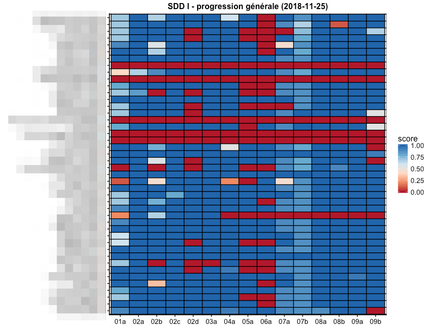

La science des données biologiques à l'Université de Mons
================
Engels Guyliann & Grosjean Philippe

Abstract
--------

Ce dépôt centralise l’ensemble des présentations, de posters ou encore d’outils de démonstrations employé pour présenter la méthode d’enseignement de la science des données biologiques en faculté des Sciences à l’Université de Mons.

Résumé
------

Depuis la rentrée académique 2017-2018, un processus de réflexion est lancé afin de renouveler l’enseignement de la biostatistique au sein du cursus de biologie. Avec la masse de données en croissance exponentielle, nécessitant des outils spécialisés pour les aborder, la crise de la reproductibilité́ en science, l’Open Science, l’Open Data, l’Open Knowledge (Directives européennes), les besoins des étudiants ont évolués.

Les noms des cours sont changé pour se nommer sciences des données biologiques. Le changement du nom de ce cours a été de pair avec une remise en question profonde sur les notions indispensables à connaitre en tant que biologiste en science des données ainsi que sur la méthode d’enseignement. Les notions importantes ont été précisément définie et répartie entre les cours de science des données I à V (dont les cours I, II et III sont des cours obligatoires durant le cursus en biologie).

Le premier cours de sciences des données biologiques I est donnée lors de l'année académique 2018-2019, un ensemble des données ont été collectée pouvant nous donner une idée de l'enthousiasme des étudiants. Prennons comme exemple, la participation aux quiz. On observe un très haut tot de participation des étudiants au séance d'exercice.

Ce graphique montre en ordonnée le nom des étudiants qui sont floutée volontaire, et en abscisse les séances d'exercices en ligne. Les scores indiquent le taux de réponses aux questions des quiz.

Présentations
-------------

-   Poster : **Introduction de nouveaux outils (learnr, Github classroom, . . . ) dans les cours de Science des Données en Biologie**

Lors de la septième édition des rencontres R à Rennes sur le site de l'Agrocampus Ouest du 4 au 6 juillet 2018, nous avons présenté le poster s'intitulant : "Introduction de nouveaux outils (learnr, Github classroom, . . . ) dans les cours de Science des Données en Biologie".

-   Présentation : **Science des données biologiques : Rendons les étudiants actifs de leurs apprentissages**

Lors d'une réunion avec le vice-recteur à l'enseignement de l'université de Mons avec Marc Demeuse, nous avons réalisé une présentation intitulée : Science des données biologiques : Rendons les étudiants actifs de leurs apprentissages

-   Evénement : **Rendons les étudiants acteurs de leur propre apprentissage de la science des données biologiques**

Lors de la journée des enseignants du 15 mars 2019, nous organisons un stand (combinaison d'un poster, d'une présentation et d'outils) afin de présenter notre philisophie d'apprentissage de la science des données biologiques intitulé : Rendons les étudiants acteurs de leur propre apprentissage de la science des données biologiques.
